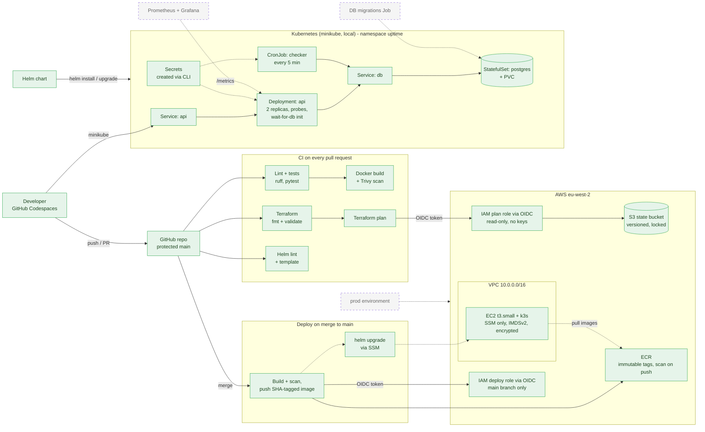

# AWS Kubernetes Platform

An end-to-end DevOps platform project: a FastAPI + PostgreSQL app, containerised with Docker, tested and scanned in GitHub Actions, packaged as a Helm chart, and deployed to Kubernetes on AWS infrastructure built with Terraform.

🚧 Work in progress: see the roadmap below.

## Architecture

🟩 Green = built · ⬜ Grey dashed = planned

## Roadmap
- [x] Dev environment defined as code (devcontainer)
- [x] Phase 1: Linux and networking basics
- [x] Phase 2: FastAPI app + Docker
- [x] Phase 3: CI with GitHub Actions
- [x] Phase 4: Terraform on AWS
- [x] Phase 5: Kubernetes locally (manifests, break/fix, Helm chart)
- [ ] Phase 6: Kubernetes on AWS + automated deploys
  - [x] k3s bootstrapped on EC2 by Terraform `user_data`
  - [x] Merges to main push scanned, SHA-tagged images to ECR
  - [ ] Auto-deploy to k3s with Helm via SSM
- [ ] Phase 7: Monitoring and alerting
- [ ] Phase 8: Security, backups, disaster recovery
- [ ] Phase 9: Polish (runbook, lessons learned)

## Docs
- [How the app works](docs/APP.md)
- [Security decisions and vulnerability triage](docs/SECURITY.md)
- [Troubleshooting log: real issues and how they were fixed](docs/TROUBLESHOOTING.md)