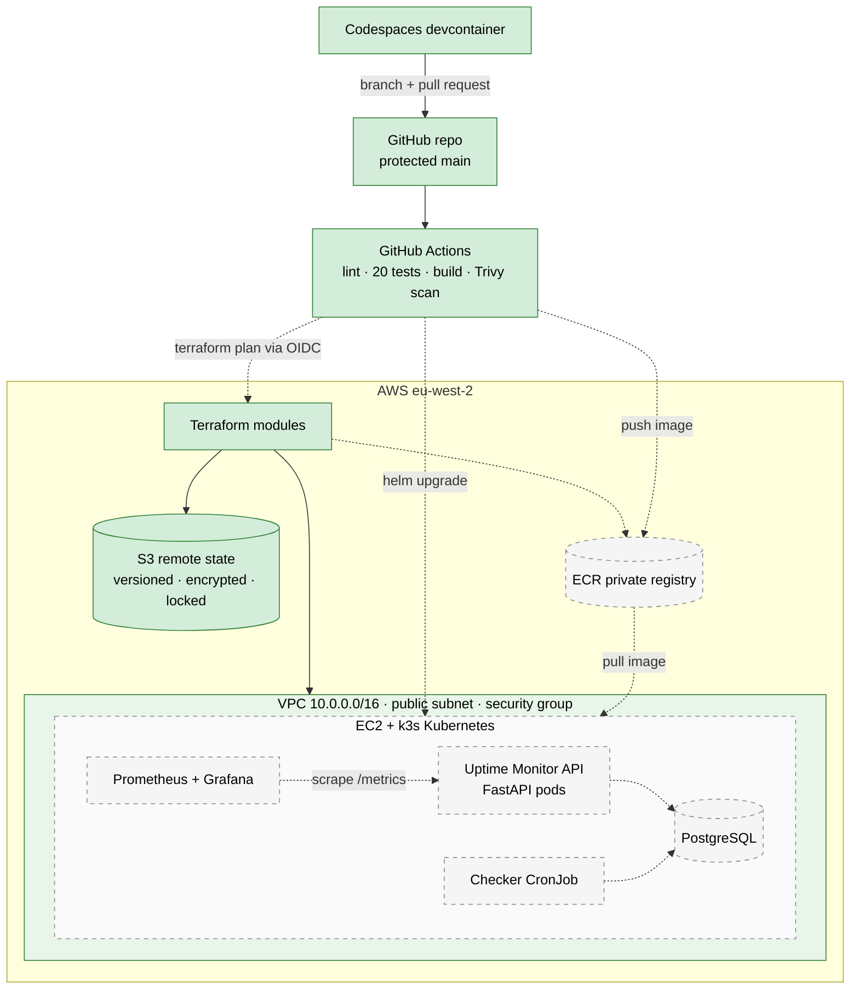

# AWS Kubernetes Platform

An end-to-end DevOps platform project: a FastAPI + PostgreSQL app, containerised with Docker, deployed to Kubernetes through GitHub Actions, on AWS infrastructure built with Terraform, with Prometheus and Grafana monitoring.

🚧 Work in progress

## Architecture

🟩 Green / solid = built · ⬜ Grey / dashed = planned

## Roadmap
- [x] Dev environment defined as code (devcontainer)
- [x] Phase 1: Linux and networking basics
- [x] Phase 2: FastAPI app + Docker
- [x] Phase 3: CI with GitHub Actions
- [ ] Phase 4: Terraform on AWS
- [ ] Phase 5: Kubernetes locally
- [ ] Phase 6: Kubernetes on AWS + automated deploys
- [ ] Phase 7: Monitoring and alerting
- [ ] Phase 8: Security, backups, disaster recovery
